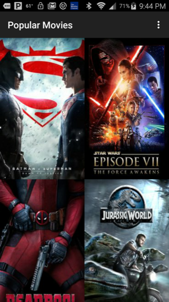
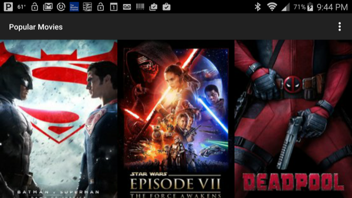
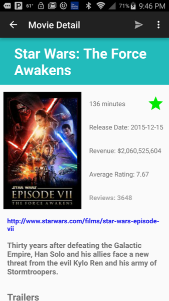
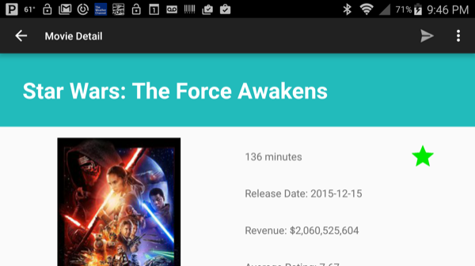
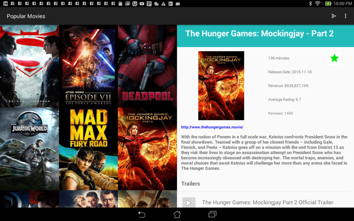
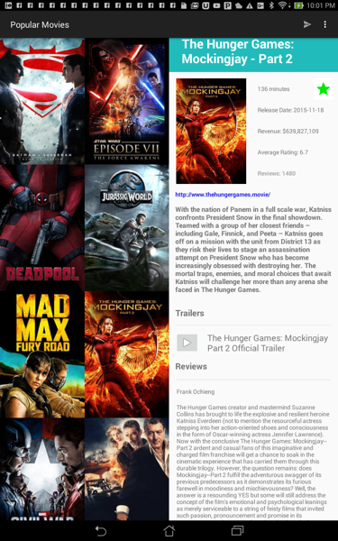
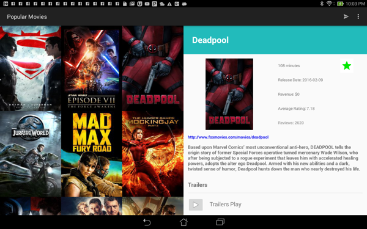

# PopularMovies2
This Android Developer Nanodegree project uses the themovieDB API to display movie information about popular and critically acclaimed movies. 
##Objectives
- Movies are displayed in the main layout via a grid of their corresponding movie poster thumbnails.
- UI contains an element (i.e a spinner or settings menu) to toggle the sort order of the movies by: most popular and highest rated.
- UI contains a screen for displaying the details for a selected movie.
- Tablet UI uses a Master-Detail layout implemented using fragments. The left fragment is for discovering movies. The right fragment displays the movie details view for the currently selected movie.
- When a trailer is selected, app uses an Intent to launch the trailer.
- In the movies detail screen, a user can tap a button(for example, a star) to mark it as a Favorite.
- App saves a "Favorited" movie to a database using the movie’s id.
- When the "favorites" setting option is selected, the main view displays the entire favorites collection based on movie IDs stored in SharedPreferences or a database.
- Implement a content provider to store favorite movie details with a database such as SQLite. Store the title, poster, synopsis, user rating, and release date and display them even when offline.
- Implement sharing functionality to allow the user to share the first trailer’s YouTube URL from the movie details screen.
- Movie details layout contains title, release date, movie poster, vote average, and plot synopsis.

##Issues

A refresh method needs to be added to update information on favorites.  Infinite scrolling needs to be added for popular and critically acclaimed movies.

##Libraries
- [Picasso](http://square.github.io/picasso) for loading images.
- [Volley](https://android.googlesource.com/platform/frameworks/volley)  for network requests.
- [Butter Knife](http://jakewharton.github.io/butterknife) for binding views.
- [Stetho](https://code.facebook.com/projects/850857854981379/stetho) for debug purposes.

##Installation 
Download the zip file and extract the contents.  From Android Studio, File - New  - Import Project. Then navigate to the top level of the PopularMovies2 project and click Ok.  An API Key needs to be downloaded from this link:[https://www.themoviedb.org/account/signup] (https://www.themoviedb.org/account/signup).
Add the Key to the following entry in the utilies/HttpHelper.java file in the project:

`private static final String key = "";`

##License

Licensed under the Apache License, Version 2.0 (the "License"); you may not use this file except in compliance with the License. You may obtain a copy of the License at

   http://www.apache.org/licenses/LICENSE-2.0
Unless required by applicable law or agreed to in writing, software distributed under the License is distributed on an "AS IS" BASIS, WITHOUT WARRANTIES OR CONDITIONS OF ANY KIND, either express or implied. See the License for the specific language governing permissions and limitations under the License.

All libraries used are licensed under their own licensing agreement.

##Images

